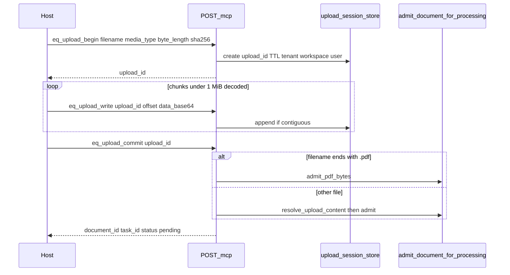

# 04 — Architecture (delta)

Parent: [README](README.md) · Prev: [03 Findings](03-findings.md) · Next: [05 Contract delta](05-contract-delta.md)

This is a delta on [SPEC-152 02-architecture](../152-new-mcp-contract/02-architecture.md).
One AgentView projection, two transports. Stdio remains a bridge.

## Profile model (amended)

| Profile | Env | Advertised tools |
|---------|-----|------------------|
| **control** (default) | unset or `control` or `memory` (alias) | All read tools + ingest + upload + download + delete + asset + graph image + task |
| **query** (lockdown) | `EDGEQUAKE_MCP_PROFILE=query` | Read tools only (today’s default set + download/asset/graph image) |

`memory` remains accepted as an alias of `control` so existing deployments that
set `memory` keep write tools.

Write **execution** still requires `edgequake:write`. Read image/download tools
use `edgequake:read`. Search/retrieve keep `edgequake:query`.

## Module map (target)

```text
edgequake-api/src/mcp/
  gateway/
    tools.rs              # catalog: add upload/download/asset/graph; control default
    dispatch.rs           # route only; no business logic
    resources.rs          # real text/original blob reads
    body.rs               # MCP_MAX_BODY_BYTES unchanged
  project/
    profile.rs            # control default; query lockdown; instructions
    ingest.rs             # NEW: text + content_base64 → admit
    upload_session.rs     # NEW: begin / write / commit / abort
    download.rs           # NEW: original / markdown chunked blob
    assets.rs             # NEW: include assets + eq_asset_get
    graph_layout.rs       # NEW: pure layout (no DB)
    graph_raster.rs       # NEW: PNG via image crate (no graph query)
    catalog.rs            # real delete accept; workspace delete not_implemented
    search.rs             # unchanged
    graph.rs              # neighborhood shared with graph_layout input
    envelope.rs           # + eq/not_implemented, eq/unsupported_media
```

## Channels

```text
tools/call result
  |
  +-- structuredContent  → SPEC-152 envelope (8 / 24 / 80 KiB)
  |
  +-- content[]
        type: text      → ≤2 KiB summary (SPEC-152 deviation preserved)
        type: image     → png|jpeg base64 (illustrations, graph PNG)
        type: resource  → blob chunk (original / markdown)
```

## Upload handle sequence



## Graph image pipeline

```text
  entity_id + hops + flags
           │
           v
  build_entity_neighborhood   (shared with eq_neighborhood)
           │
           v
  graph_layout::layout        pure: focus center, hop rings, truncate labels
           │
           v
  graph_raster::to_png        image crate; theme tokens in one module
           │
           v
  content[ImageContent] + structuredContent { width, height, entity_count, ... }
```

Tests assert focus within center tolerance and PNG magic bytes. They do not
assert pixel equality with the Web UI.

## Upload session store

Stateless `POST /mcp` requires durable handles across calls.

| Field | Rule |
|-------|------|
| `upload_id` | Opaque UUID |
| Binding | tenant_id, workspace_id, user_id |
| TTL | Configurable; default 1 hour; expired → `eq/not_found` |
| Size | Cap = REST `max_document_size` / upload cap |
| Storage | New table `mcp_upload_sessions` (+ chunk blobs or temp files under workspace root) — see Database lens |
| Not a bearer | Foreign workspace cannot resume the handle |

Graph PNGs are **not** stored. Illustration bytes are read from
`document_mm_assets`.

## Env knobs (new)

| Variable | Default | Purpose |
|----------|---------|---------|
| `EDGEQUAKE_MCP_PROFILE` | unset = **control** | `query` lockdown; `memory` alias of control |
| `EDGEQUAKE_MCP_BLOB_MAX_BYTES` | `4194304` (4 MiB) | Max decoded bytes per image/blob response before downsample or chunk |
| `EDGEQUAKE_MCP_UPLOAD_TTL_SECS` | `3600` | Upload handle TTL |
| `MCP_MAX_BODY_BYTES` | `1048576` | Unchanged request body cap |

## DRY / SOLID checkpoints

- Dispatch never admits or deletes.
- Layout never opens a DB connection.
- Raster never calls graph storage.
- Stdio never implements budgets or ranking (LAW-161-9).
